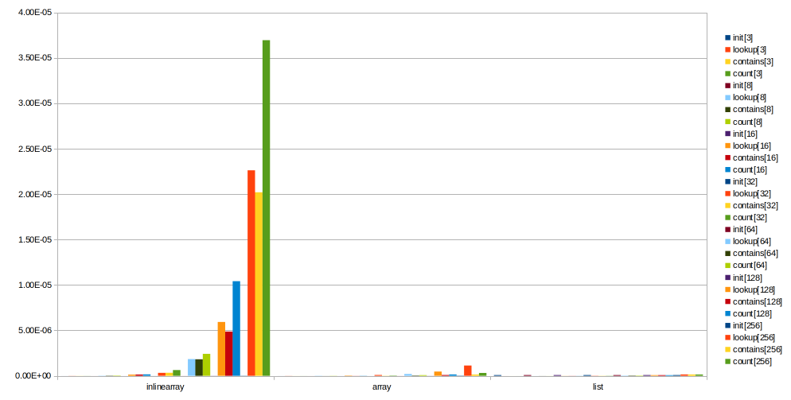
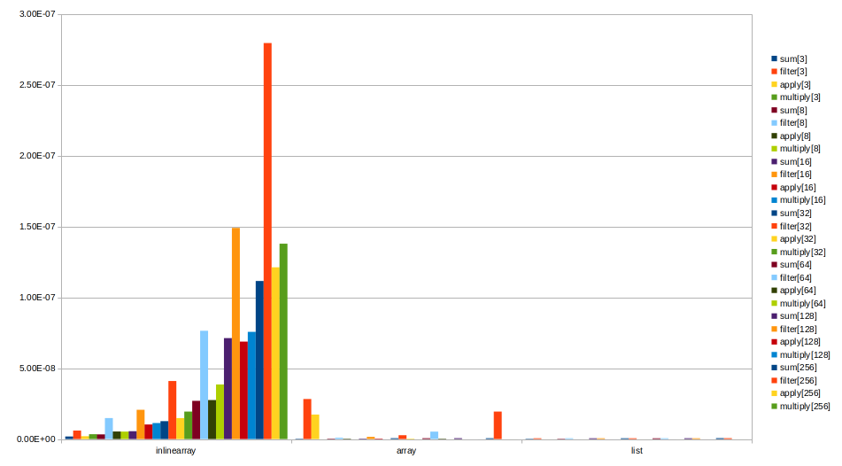
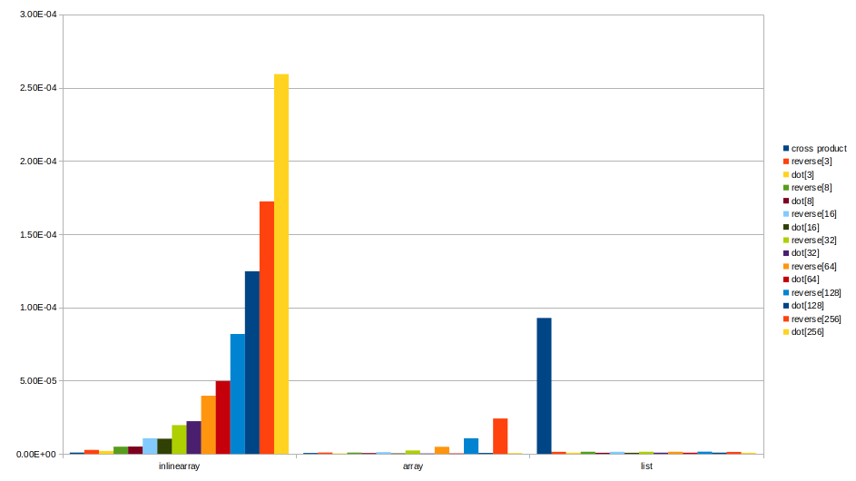

# Benchmarks

## Benchmark Array against List and InlineArray
- Using: Intel® i7-7700HQ @2.80 GHz (Instruction Set Extensions
    Intel® SSE4.1, Intel® SSE4.2, Intel® AVX2)

| Cache    |                   |
|----------|-------------------|
| Cache L1 | 64 KB (per core)  |
| Cache L2 | 256 KB (per core) |
| Cache L3 | 6 MB (shared)     |

- amount items = (3, 8, 16, 32, 64, 128, 256)
- datatype = UInt64
- average of 5 iterations with 100 warmup (several runs had similar results)

#### Results for "standard" sequential collection operations:

#### Numeric operations
Removing the outliers from Array (happens only with filter and apply operation
with 128 Int64 (1 kB), no idea why):
| Structure   | filter[128]   |	apply[128]|
|-------------|---------------|-----------|
| InlineArray |1.49E-07       |	6.88E-08  |
| Array       |2.17E-06       |	3.81E-06  |
| List        |5.52E-10       |	2.50E-17  |

This graph results:

#### Vector operations

- 1k times reverse (UInt64)
- 1k times dot product (Float64)
- 5k times cross product (Float64)

